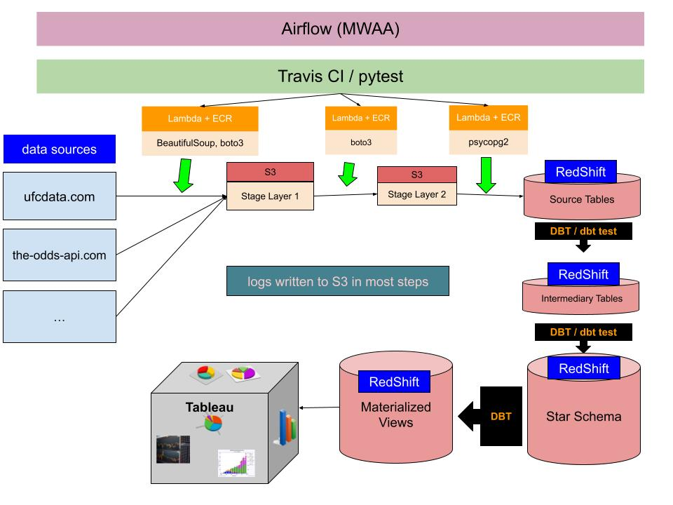
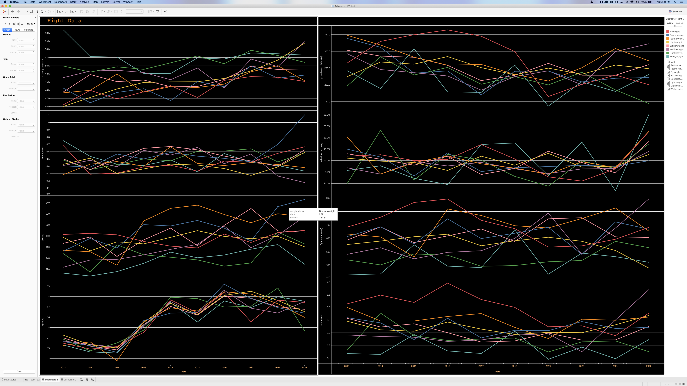
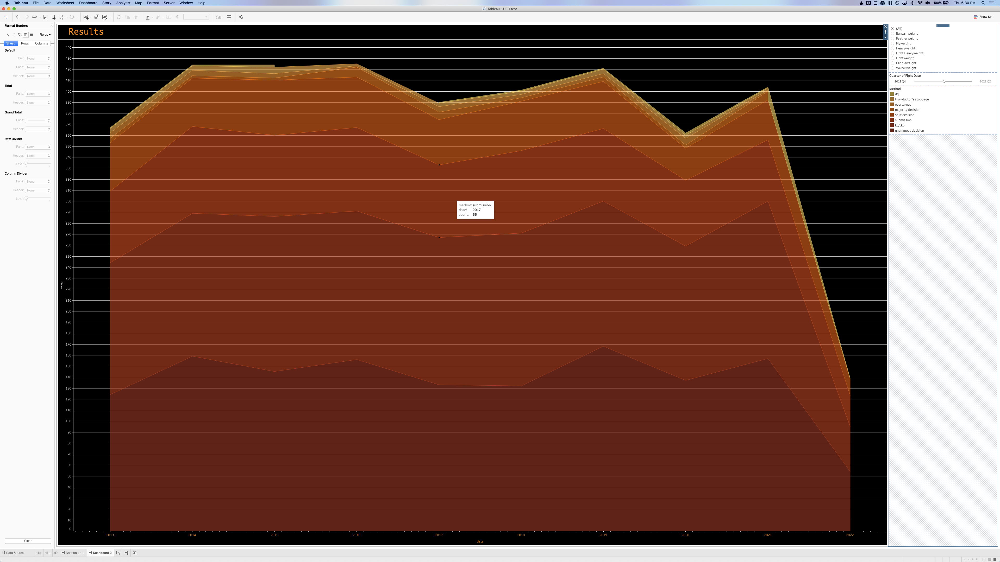

<h3>Code Status:</h3>

Hi. This is my personal project where I hope to aggregate all available data in the world about mma in the UFC league.

<h3>Stack</h3>

💻 Data Engineering Tools: Airflow,  Docker, DBT, 

☁️ Cloud: AWS (Lambda, S3, Redshift, ECR, MWAA)

✅ CI/Testing: DBT tests, Travis CI, Pytest

📊 Visualization: Tableau

📚 Libraries: pandas, boto3, awswrangler, beautifulsoup, psycop2g

🌈 Languages: Python/SQL (Redshift's version of Postgres)

🧰 Workflow Tools: Black (linter), VSCode, Datagrip

Notes:
- Dashboards not deployed due to TableauServer not having a free tier and my Redshift/MWAA costs lightly bankrupting me.
- No IaaC. Current terraform skills non-existant.

